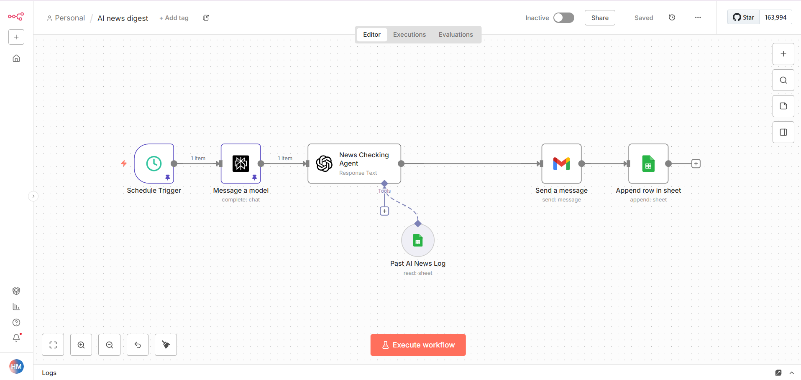

# 📰 AI News Digest Automation – n8n Workflow

This workflow automatically collects the latest AI news every day, removes duplicate headlines using a historical Google Sheet, and emails a clean digest.

---

## 🔄 Workflow Logic

| Step | Node | Purpose |
|------|------|---------|
| 1 | Schedule Trigger | Runs daily at 9:00 AM |
| 2 | Perplexity – Message a model | Fetches latest AI news |
| 3 | OpenAI – News Checking Agent | Cleans and removes duplicate items |
| 4 | Google Sheets Tool – Past AI News Log | Prevents duplicate news |
| 5 | Gmail – Send a message | Emails daily digest |

---

## 🖼️ Workflow Diagram




---

## ⚙️ Setup Instructions (End-to-End)

### 1️⃣ Import Workflow

Open n8n → **Import Workflow** → Upload:

```
ai-news-digest.json
```

---

### 2️⃣ Create Google Sheet – Past AI News Log

Create a Google Sheet named:

```
Past AI News Log
```

Add these columns:

| Date | Headlines |

---

### 3️⃣ Configure Google Sheets Credential

n8n → **Credentials → Add new → Google Sheets OAuth2**

- Connect your Google account  
- Select the `Past AI News Log` file in the node

---

### 4️⃣ Configure Perplexity API

- Get API key from https://www.perplexity.ai/settings/api  
- Add new credential → **Perplexity API**

---

### 5️⃣ Configure OpenAI API

- Get API key from https://platform.openai.com/api-keys  
- Add new credential → **OpenAI API**

---

### 6️⃣ Configure Gmail OAuth

n8n → **Credentials → Add new → Gmail OAuth2** → Connect Gmail

---

### 7️⃣ Set Email Environment Variable

Linux / Mac:

```
export NEWS_DIGEST_EMAIL=your@email.com
```

Windows PowerShell:

```
setx NEWS_DIGEST_EMAIL "your@email.com"
```

Restart n8n after this.

---

### 8️⃣ Attach Credentials to Nodes

| Node | Credential |
|------|------------|
| Message a model | Perplexity API |
| News Checking Agent | OpenAI API |
| Past AI News Log | Google Sheets OAuth |
| Send a message | Gmail OAuth |

---

### 9️⃣ Activate Workflow

Turn workflow toggle to **Active**.

---

### 🔟 Test Run

Click **Execute Workflow** once.

You should receive the **AI News Digest email** in your inbox.

