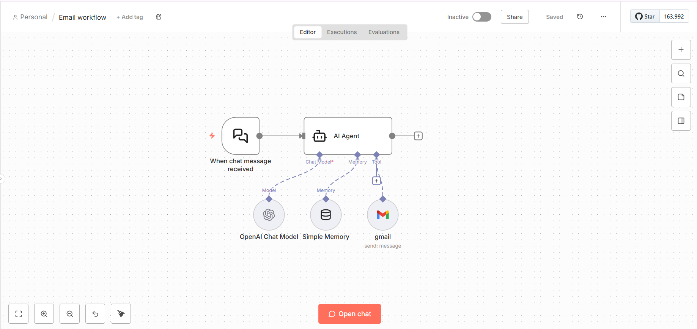

# 📧 AI Email Automation – n8n Workflow

An AI-powered email assistant that listens for chat messages, intelligently composes emails using an LLM with memory, and sends them automatically via Gmail.

---

## 🔄 Workflow Logic

| Step | Node | Purpose |
|------|------|---------|
| 1 | Chat Trigger – When chat message received | Captures user chat input |
| 2 | AI Agent | Determines email content dynamically |
| 3 | OpenAI Chat Model | Generates email subject & body |
| 4 | Simple Memory | Maintains short-term context |
| 5 | Gmail Tool | Sends the email |

---

## 🖼️ Workflow Diagram




---

## ⚙️ Setup Instructions

### 1️⃣ Import Workflow

Open **n8n** → **Import Workflow** → Upload:

```
email-workflow.json
```

---

### 2️⃣ Configure Credentials

Create the following credentials in n8n:

| Service | Purpose |
|--------|---------|
| OpenAI API | Generate email content |
| Gmail OAuth2 | Send emails |

---

### 3️⃣ Attach Credentials to Nodes

| Node | Credential |
|------|------------|
| OpenAI Chat Model | OpenAI API |
| Gmail Tool | Gmail OAuth2 |

---

### 4️⃣ Activate Workflow

Toggle the workflow to **Active**.

---

### 5️⃣ Test the Flow

Send a chat message like:

```
Send a mail to john@example.com about tomorrow's meeting at 10 AM.
```

The workflow will automatically compose and send the email.


