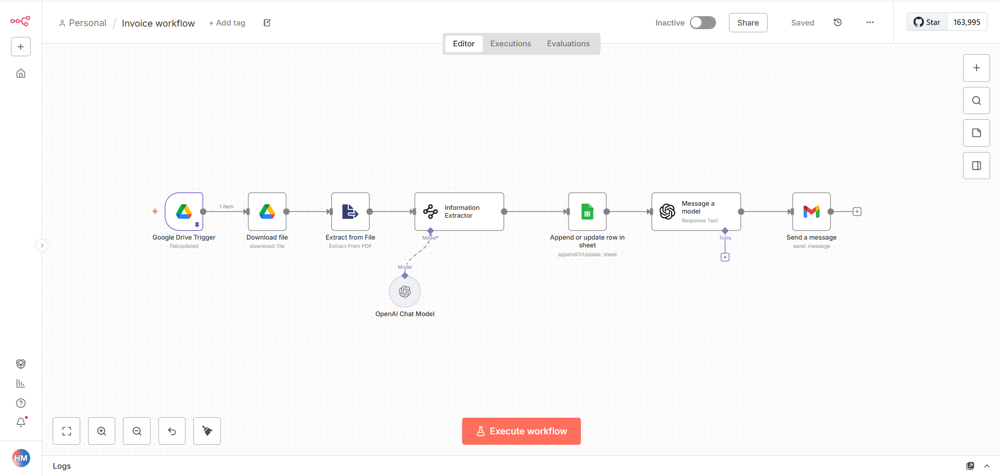

# 🧾 Invoice Processing Automation – n8n Workflow

This workflow automatically detects new invoice PDFs uploaded to Google Drive, extracts all billing details using AI, stores the data in Google Sheets, and notifies the billing team via Gmail.

---

## 🔄 Workflow Logic

| Step | Node | Purpose |
|------|------|---------|
| 1 | Google Drive Trigger | Detects new invoice files |
| 2 | Download File | Downloads the PDF invoice |
| 3 | Extract from File | Extracts raw text from invoice |
| 4 | Information Extractor | Extracts structured invoice fields |
| 5 | Google Sheets – Append/Update | Stores invoice details |
| 6 | OpenAI – Message a model | Generates billing email |
| 7 | Gmail – Send a message | Sends invoice alert email |

---

## 🖼️ Workflow Diagram



---

## ⚙️ Setup Instructions

### 1️⃣ Import Workflow

Open **n8n** → **Import Workflow** → Upload:

```
invoice-workflow.json
```

---

### 2️⃣ Create Invoice Database Sheet

Create a Google Sheet named:

```
Invoice DB
```

Add these columns exactly:

| Invoice Number | Client Name | Client Email | Client Address | Client Phone | Total Amount | Invoice Date | Due Date |

---

### 3️⃣ Configure Credentials

Create the following credentials in n8n:

| Service | Purpose |
|--------|---------|
| Google Drive OAuth2 | Detect & download invoices |
| Google Sheets OAuth2 | Store invoice data |
| OpenAI API | Extract invoice fields & generate email |
| Gmail OAuth2 | Send billing notifications |

---

### 4️⃣ Attach Credentials to Nodes

| Node | Credential |
|------|------------|
| Google Drive Trigger | Google Drive OAuth2 |
| Download file | Google Drive OAuth2 |
| Append or update row in sheet | Google Sheets OAuth2 |
| Message a model | OpenAI API |
| Send a message | Gmail OAuth2 |

---

### 5️⃣ Set Billing Email Variable

Linux / Mac:

```
export BILLING_TEAM_EMAIL=billing@yourcompany.com
```

Windows PowerShell:

```
setx BILLING_TEAM_EMAIL "billing@yourcompany.com"
```

Restart n8n after this.

---

### 6️⃣ Activate Workflow

Toggle the workflow to **Active**.

---

### 🔟 Test Flow

Upload a new invoice PDF to the connected Google Drive folder.

You should see:
- Invoice fields added to Google Sheet
- Billing email sent automatically


