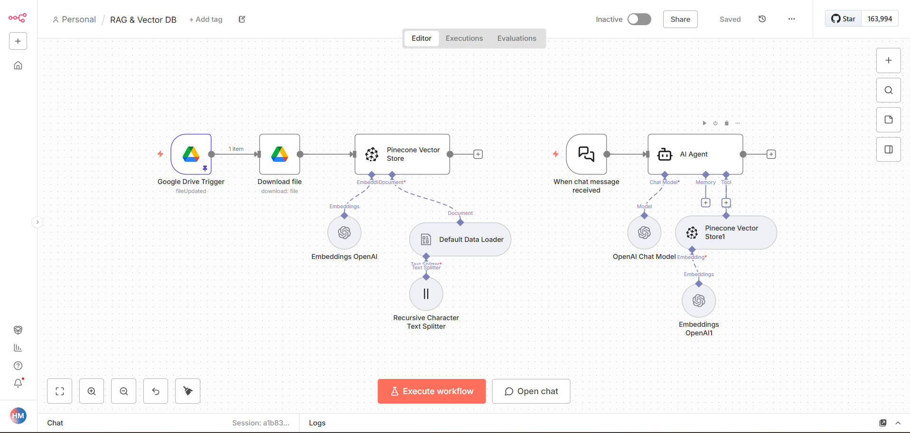

# 🧠 RAG & Vector Database Automation – n8n Workflow

This workflow implements a **Retrieval-Augmented Generation (RAG)** system that ingests policy documents, stores embeddings in a vector database, and answers user questions using semantic search.

---

## 🔄 Workflow Logic

| Step | Node | Purpose |
|------|------|---------|
| 1 | Google Drive Trigger | Detects new or updated policy documents |
| 2 | Download File | Downloads the document |
| 3 | Default Data Loader | Loads document content |
| 4 | Recursive Character Text Splitter | Splits content into chunks |
| 5 | Embeddings OpenAI | Generates vector embeddings |
| 6 | Pinecone Vector Store (Insert) | Stores vectors in Pinecone |
| 7 | Chat Trigger | Receives user queries |
| 8 | AI Agent + OpenAI | Answers questions |
| 9 | Pinecone Vector Store (Retrieve) | Retrieves relevant policy chunks |

---

## 🖼️ Workflow Diagram



---

## ⚙️ Setup Instructions

### 1️⃣ Import Workflow

Open **n8n** → **Import Workflow** → Upload:

```
rag-vector-db.json
```

---

### 2️⃣ Prepare Policy Documents

Upload your policy documents (`.txt`, `.pdf`) to Google Drive.  
Any update will automatically refresh the vector database.

---

### 3️⃣ Create Pinecone Index

Create a Pinecone index named:

```
rag
```

Use namespace:

```
policies
```

---

### 4️⃣ Configure Credentials

Create the following credentials in n8n:

| Service | Purpose |
|--------|---------|
| Google Drive OAuth2 | Detect & download files |
| OpenAI API | Generate embeddings & answers |
| Pinecone API | Store & retrieve vectors |

---

### 5️⃣ Attach Credentials to Nodes

| Node | Credential |
|------|------------|
| Google Drive Trigger | Google Drive OAuth2 |
| Download file | Google Drive OAuth2 |
| Embeddings OpenAI | OpenAI API |
| Pinecone Vector Store | Pinecone API |
| OpenAI Chat Model | OpenAI API |

---

### 6️⃣ Activate Workflow

Turn the workflow toggle to **Active**.

---

### 🔟 Test Flow

Upload a new policy document and ask in chat:

```
What is the cancellation policy?
```

You will receive an answer from your private knowledge base.


